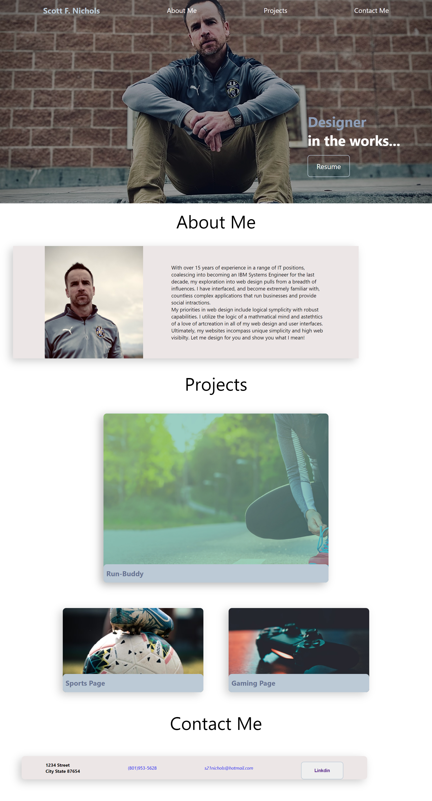

# scott-nichols-dev-portfolio

Scott Nichols Initial Portfolio Landing Page

* It includes a nav bar on top for desktop viewing and switches to bottom on smaller devices.
* The page has a hero image of myself with a catchy phrase and link to download my resume.
* There is a section with a breif description of my focus in design and what I aim to do.
* I've listed 3 projects I've worked on. The first being my Run-Buddy work and the other two as place holders. Each includes an image of the page's subject.
* I've included a Contact Me sectin with phony information but a real link to my linkdin.

Site URL: https://sessions21.github.io/scott-nichols-dev-portfolio/

